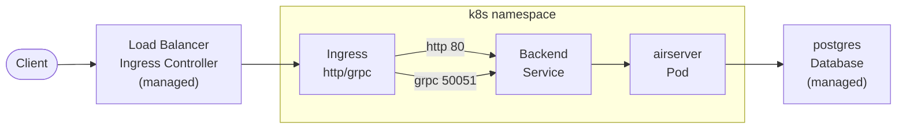

<!--
SPDX-FileCopyrightText: 2025 Phoenix R&D GmbH <hello@phnx.im>

SPDX-License-Identifier: CC-BY-SA-4.0
-->

# Backend Deployment

The backend server is deployed automatically from GitHub Actions. Currently,
other changes to the backend are applied manually.

### Load Balancer and Ingress Controller

```
helm upgrade --install ingress-nginx ingress-nginx \
  --repo https://kubernetes.github.io/ingress-nginx \
  --namespace ingress-nginx --create-namespace \
  --values ingress-nginx-values.yaml
```

The managed Load Balancer is configured via the custom
`service.beta.kubernetes.io/upcloud-load-balancer-config` annotation inside
[ingress-nginx-values.yaml].

### Ingress

```
kubectl apply -f ingress-http.yaml
kubectl apply -f ingress-grpc.yaml
```

### Service

```
kubectl apply -f phnx-backend.yaml
```

[ingress-nginx-values.yaml]: ./ingress-nginx-values.yaml


## Architecture


